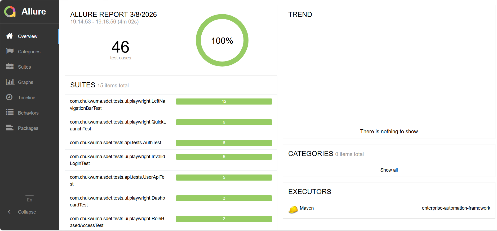

# 🚀 Enterprise Test Automation Framework


## Playwright (Java) | Selenium | RestAssured | JUnit 5 | CI/CD | Parallel-Ready

A production-style UI test automation framework built with **Java + Playwright** designed for **scalability, determinism, and CI reliability.**

This project demonstrates how enterprise SDET teams architect automation frameworks — focusing on lifecycle control, isolation, parallel execution, and flakiness mitigation.

## Table of Contents
- [Architecture Overview](#architecture-overview)
- [Project Structure](#project-structure)
- [CI/CD Pipeline](#cicd-pipeline)
- [Design Principles](#design-principles)
- [Test Strategy](#test-strategy)
- [Running Tests Locally](#running-tests-locally)
- [Execution Metrics](#execution-metrics)
- [Execution Reports](#execution-reports)
- [Technology Stack](#technology-stack)
- [Current Automation Testing Coverage](#current-automation-testing-coverage)
- [Failure Observability Strategy](#failure-observability-strategy)
- [Smoke vs Regression Strategy](#smoke-vs-regression-strategy)
- [Screenshot-on-Failure Strategy](#screenshot-on-failure-strategy)
- [Running Tagged Suites](#running-tagged-suites)
- [Headed vs Headless Execution](#headed-vs-headless-execution)
- [Configuration Management](#configuration-management)
- [Additional Documentation](#additional-documentation)

## Architecture Overview

```
                           ┌───────────────────────────────┐
                           │        Test Classes           │
                           │  UI | API | Performance Tests │
                           └───────────────┬───────────────┘
                                           │
                           ┌───────────────▼───────────────┐
                           │            BaseTest           │
                           │  Lifecycle & Environment Mgmt │
                           └───────────────┬───────────────┘
                                           │
          ┌────────────────────────────────▼────────────────────────────────┐
          │                     Test Abstraction Layers                     │
          │                                                                 │
          │  UI Layer          API Layer           Performance Layer        │
          │  Playwright        RestAssured         k6                       │
          │  Selenium          Service Clients     Load Scripts             │
          └────────────────────────────────┬────────────────────────────────┘
                                           │
                           ┌───────────────▼───────────────┐
                           │         Test Data Layer       │
                           │   Models | Factories | JSON   │
                           └───────────────┬───────────────┘
                                           │
                           ┌───────────────▼───────────────┐
                           │        CI/CD Pipeline         │
                           │ GitHub Actions + Allure Report│
                           └───────────────────────────────┘
```

⬆️ [Back to Table of Contents](#table-of-contents)

## Project Structure

```
sdet-enterprise-automation-framework
│
├── performance-tests
│   └── k6
│       ├── smoke
│       │   └── users-smoke.js
│       │
│       ├── load
│       │   └── users-load.js
│       │
│       └── spike
│           └── users-spike.js
│
├── src
│   ├── main/java/com/chukwuma/sdet
│   │   ├── config                # environment configuration
│   │   ├── pages                 # page objects for UI automation
│   │   └── utilities             # shared utility classes
│   │
│   └── test/java/com/chukwuma/sdet
│       ├── base                  # base test setup and configuration
│       ├── models                # API data models / DTOs
│       ├── utils                 # test utilities
│       ├── extensions            # JUnit extensions
│       │
│       ├── api
│       │   ├── tests             # API test cases
│       │   └── service           # API service layer
│       │
│       ├── ui
│       │   ├── selenium          # Selenium UI tests
│       │   └── playwright        # Playwright UI tests
│       │
│       └── database              # database-related tests
│
├── scripts
│   └── run-performance-tests.sh
│
├── docker
│   └── docker-compose.yml
│
├── pom.xml
└── README.md
```

⬆️ [Back to Table of Contents](#table-of-contents)

## CI/CD Pipeline

The framework is designed for CI-first execution using GitHub Actions.
Tests run in parallel across separate jobs to improve feedback speed.

Pipeline file:
```
.github/workflows/ci-pipeline.yml
```

### 🔁 CI/CD Execution Flow

```
Developer Push
      │
      ▼
GitHub Actions Trigger
      │
      ▼
Parallel Test Jobs
 ├── API Tests
 ├── Playwright UI Tests
 └── Selenium UI Tests
      │
      ▼
Allure Results Collected
      │
      ▼
Unified Allure Report Generated
      │
      ▼
Report Published via GitHub Pages
```

⬆️ [Back to Table of Contents](#table-of-contents)

## Design Principles

The framework was designed with long-term maintainability and CI reliability in mind.
Tests are designed to be deterministic, parallel-safe, and CI-first.

Core principles include:

**Test Independence**  
- Tests run safely in any order, enabling deterministic parallel execution.

**Separation of Concerns**  
- Test logic, page interactions, configuration, and utilities are clearly separated.

**Maintainable Locators**  
- All UI locators live inside Page Objects to reduce duplication and simplify updates.

**Reusable Components**  
- Shared behaviors such as authentication, configuration loading, and test data management are abstracted into reusable utilities.

**CI-First Execution**  
- Tests are designed for reliable CI execution through headless mode, failure observability, and deterministic state management.

⬆️ [Back to Table of Contents](#table-of-contents)

## Test Strategy

The framework follows a layered testing strategy to balance speed, reliability, and coverage.

| Layer                 | Purpose                                   | Tooling       |
|-----------------------|-------------------------------------------|---------------|
| Performance Tests     | Validate system scalability and throughput| k6            |
| API Tests             | Validate backend behavior and contracts   | RestAssured   |
| UI Tests (Playwright) | Fast modern browser automation            | Playwright    |
| UI Tests (Selenium)   | Cross-browser compatibility validation    | Selenium      |

```
           UI Tests
      (Playwright / Selenium)
               │
               ▼
        Service/API Tests
           (RestAssured)
               │
               ▼
       Contract Validation
         (JSON Schema)
               │
               ▼
       Performance Testing
               (k6)
```
Playwright provides fast modern browser automation while Selenium is retained for cross-browser validation and legacy ecosystem compatibility.

### Testing Pyramid
```
                /\
               /  \
              /E2E \
             / UI   \
            / Tests  \
           /----------\
          / Integration\
         /    Tests     \
        /----------------\
       /  API / Service   \
      /      Tests         \
     /----------------------\
    /       Unit Tests       \
   /__________________________\
```   

Test Distribution Strategy

- Unit Tests → Fast, isolated, largest coverage
- API / Service Tests → Validate business logic
- Integration Tests → Verify component interaction
- E2E UI Tests → Critical user workflows only

### Execution Strategy

**Smoke Tests**
  - Run on every pull request
  - Validate critical user flows

**Regression Tests**
  - Run on scheduled builds or full CI runs
  - Provide broader coverage of functionality

**Test Execution**

The framework supports two execution environments:

1. Public OrangeHRM demo site (default)
2. Local Docker environment (optional)

⬆️ [Back to Table of Contents](#table-of-contents)

## Running Tests Locally

### 1️⃣ Clone the Repository
```
git clone https://github.com/chukwuma1976/sdet-enterprise-automation-framework.git
cd sdet-enterprise-automation-framework
```
### 2️⃣ Execute Tests
```
mvn clean test
```
### 3️⃣ Debug Mode (Headed Browser)
Set in `config.properties`:
```
headless=false
```

### How To Run Other Tests Locally
- [Performance Testing](docs/performance-tests.md)
- [Tagged Suites Testing](docs/tagged-suites-tests.md)

⬆️ [Back to Table of Contents](#table-of-contents)

## Execution Metrics

Execution times measured locally (parallel enabled):

| Suite Type | Command                        | Tests | Execution Time |
| ---------- | ------------------------------ | ----- | -------------- |
| Smoke      | `mvn test -Dgroups=smoke`      | 10    | ~42 seconds    |
| Regression | `mvn test -Dgroups=regression` | 34    | ~2 minutes 22s |
| API Only   | `mvn test -Dgroups=api`        | 12    | ~12 seconds    |
| UI Only    | `mvn test -Dgroups=ui`         | 34    | ~2 minutes 53s |

A health check verifies that the target application is reachable before tests begin.

If the service is unavailable, tests are skipped to prevent false failures.

⬆️ [Back to Table of Contents](#table-of-contents)

## Execution Reports

### 📊 For Live Allure Report
```
https://chukwuma1976.github.io/sdet-enterprise-automation-framework
```

#### Sample Allure Report



### Performance Testing Report
- [Performance Test Reports](docs/performance-tests.md#performance-test-reports)

⬆️ [Back to Table of Contents](#table-of-contents)

## Technology Stack

| Layer             | Technology                 |
| ----------------- | -------------------------- |
| Language          | Java 17                    |
| UI Automation     | Playwright (Java)          |
| API Automation    | RestAssured                |
| Contract Testing  | JSON Schema Validation     |
| Performance Tests | k6                         |
| Test Runner       | JUnit 5                    |
| Build Tool        | Maven                      |
| CI/CD             | GitHub Actions             |
| Design Pattern    | Page Object Model          |
| Test Data         | JSON + Model Mapping       |
| Config Management | Properties + Env Variables |

⬆️ [Back to Table of Contents](#table-of-contents)

## Current Automation Testing Coverage

### API Testing

* ✅ API CRUD testing: get all users, get users by id, add, edit, and delete User
* ✅ Authentication and Role Based Access Control (RBAC) testing
* ✅ Consumer contract validation using JSON Schema

### UI Testing

* ✅ Successful login
* ✅ Invalid username
* ✅ Invalid password
* ✅ Required field validation
* ✅ Negative authentication scenarios
* ✅ Role Based Access Control (RBAC) testing
* ✅ Employee CRUD testing scenarios: Add, Edit, Delete Employee
* ✅ Dashboard Testing Scenarios

### Performance Testing

* ✅ Smoke testing
* ✅ Load testing
* ✅ Spike testing

⬆️ [Back to Table of Contents](#table-of-contents)

## Failure Observability Strategy

To improve CI debuggability:

* Screenshot captured at failure point
* Uses TestExecutionExceptionHandler
* Avoids lifecycle timing issues
* Failure artifacts available in CI logs

Result: Deterministic, observable, and debuggable automation.

⬆️ [Back to Table of Contents](#table-of-contents)

## Smoke vs Regression Strategy

The framework uses JUnit 5 tags to control test scope.

### Smoke Tests
Smoke tests validate critical user work flows and run on every CI pipeline execution.

Typical coverage:

* Login
* Core navigation
* Critical CRUD flows
* Basic API health checks

Execution time target:
```
< 1 minute

```
### Regression Tests

Regression tests validate **broader system functionality** including:

* edge cases
* validation rules
* negative scenarios
* full UI/API coverage

Regression suites are typically executed:

* nightly
* before release
* during extended pipeline validation

⬆️ [Back to Table of Contents](#table-of-contents)

## Screenshot-on-Failure Strategy

When UI tests fail in CI environments, diagnosing issues without visual artifacts becomes difficult.

This framework implements **automatic screenshot capture at the moment of failure.**

Implementation approach:

* Uses **JUnit 5 TestExecutionExceptionHandler**
* Captures screenshot **before browser teardown**
* Avoids lifecycle timing issues caused by TestWatcher

Lifecycle flow:
```
Test Failure
      ↓
Exception Intercepted
      ↓
Screenshot Captured
      ↓
Failure Propagated
```

Benefits:

* Faster debugging
* Clear CI diagnostics
* Reduced time investigating failures

⬆️ [Back to Table of Contents](#table-of-contents)

## Running Tagged Suites

Tests are organized using **JUnit 5 tags.**

### Test Suites

The framework uses JUnit `@Tag` annotations to organize tests into logical suites.  
These tags allow selective execution of tests for different purposes such as smoke testing, regression testing, UI testing, or API validation.

| Suite Name      | Tag                   |
|-----------------|-----------------------|
| smoke           | `@Tag("smoke")`       |
| regression      | `@Tag("regression")`  |
| ui              | `@Tag("ui")`          |
| api             | `@Tag("api")`         |
| playwright      | `@Tag("playwright")`  |
| selenium        | `@Tag("selenium")`    |

#### Example

```java
@Tag("smoke")
@Tag("ui")
@Test
void userCanLogin() {
    // test implementation
}
```

Run only smoke tests:
```
mvn test -Dgroups=smoke
```
Run regression suite:
```
mvn test -Dgroups=regression
```
Run API tests only:
```
mvn test -Dgroups=api
```
Run UI tests only:
```
mvn test -Dgroups=ui
```
Run a specific test class:
```
mvn -Dtest=ClassName test
```

⬆️ [Back to Table of Contents](#table-of-contents)

## Headed vs Headless Execution

The framework supports both **headed (local debugging)** and **headless (CI execution)** modes.

### Headed Mode
Used during local debugging.
```
headless=false
```
Benefits:

* Visual debugging
* Step-by-step test observation
* Development troubleshooting

### Headless Mode
Used in CI environments.
```
headless=true
```
Benefits:

* Faster execution
* Reduced resource usage
* CI pipeline compatibility

CI pipelines always execute in headless mode.

⬆️ [Back to Table of Contents](#table-of-contents)

## Configuration Management

* Centralized `ConfigReader`
* `config.properties`
* Environment variable override support
* Designed for multi-environment execution (dev / staging / prod)
* CI-friendly configuration injection

⬆️ [Back to Table of Contents](#table-of-contents)

## Additional Documentation

For deeper architectural explanations see:

- [Browser Lifecycle Management](docs/browser-lifecycle.md)
- [Parallel Execution Strategy](docs/parallel-execution.md)
- [Failure Observability & Flakiness Mitigation](docs/flakiness-strategy.md)
- [Retry Strategy](docs/retry-strategy.md)
- [Database Validation Architecture](docs/database-validation.md)

⬆️ [Back to Table of Contents](#table-of-contents)

## Why This Project Stands Out

This is not a tutorial project.

It demonstrates:

* Enterprise automation architecture
* Parallel-safe framework design
* CI-integrated execution
* Deterministic lifecycle management
* Failure observability engineering
* Clean separation of concerns

Designed and implemented with real-world SDET practices.

## 👤 Author
### Chukwuma Anyadike
Software Development Engineer in Test (SDET)

Automation Engineering | Playwright | Java | CI/CD | Parallel Architecture | API & UI Testing